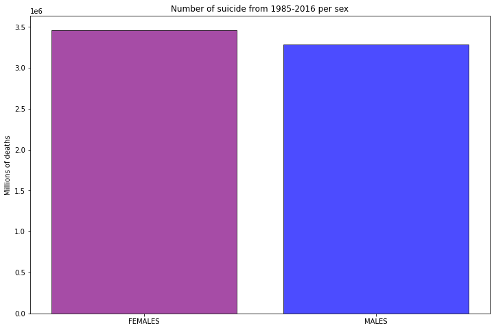
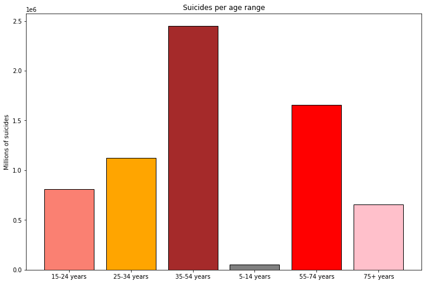
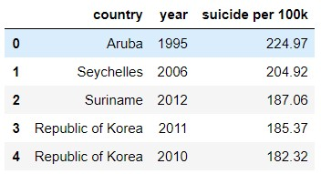

# Suicide rates
This project aims to analyse the suicide rates in different countries around the world.

## Initial dataset
The original dataset from this project has been retrieved from [kaggle](https://www.kaggle.com/russellyates88/suicide-rates-overview-1985-to-2016).

We will try to relate this data with external conditions such us wars, drugs, wheather, religion or the arrival of social media, trying to find out what increases or decreases the suicide rates over the world.

After the clean up, our datasett looks like this:

- **country:** The countries in the dataset are mostly countries from North and South America, Europe, Oceania, South Africa, Mongolia, Japan ... excluding Russia and a big region of Africa.
- **year:** it collects data between 1986 and 2016. 
- **sex:** male or female.
- **age_range:** 
  - 15-24 years
  - 25-34 years     
  - 35-54 years 
  - 55-74 years 
  - 75+ years      

- **suicide_number:** number of suicides in that country, year and range of age.
- **population:** country population.
- **suicides/100k:** suicides per 100k people.
- **gdp_for_year:** gdp (pib) per year.
- **gdp_per_capita:** gdp (pib) per capita.
- **generation:** 
  - Generation X       
  - Silent             
  - Millenials         
  - Boomers            
  - G.I. Generation  

## First analysis:

#### Suicides by sex
It is impressive to see that just between 1985 and 2016, there are more than 6.5 millions suicides in this countries, mostly women suicides. If we add countries like Russia or China to the study, this amount increases to over 20 million suicides, we will try to include these data later to the dataset.

#### Ages
The rate is bigger between 35 and 54 years old.

#### Countries

#### Years

#### GDP for year

## References:
- United Nations Development Program. (2018). Human development index (HDI). Retrieved from [link](http://hdr.undp.org/en/indicators/137506).

- World Bank. (2018). World development indicators: GDP (current US$) by country:1985 to 2016. Retrieved from [link](http://databank.worldbank.org/data/source/world-development-indicators#).

- [Szamil]. (2017). Suicide in the Twenty-First Century [dataset]. Retrieved from [link](https://www.kaggle.com/szamil/suicide-in-the-twenty-first-century/notebook).

- World Health Organization. (2018). Suicide prevention. Retrieved from [link](http://www.who.int/mental_health/suicide-prevention/en/).